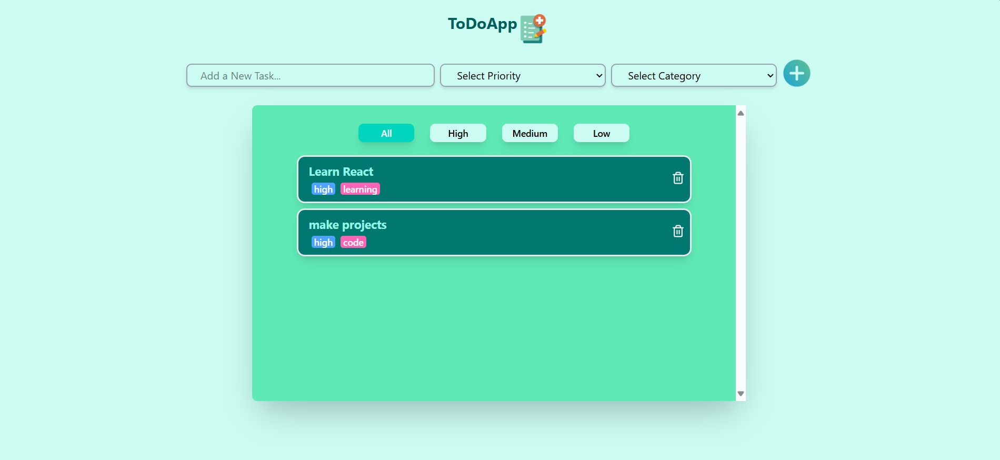

# 📝 React To-Do Application (Priority-Based)

A simple **To-Do application** built with **React** to help users manage their tasks efficiently.  
This project is designed for beginners to understand the **basics of React** such as components, state, props, event handling, and conditional rendering.  
Users can categorize their tasks based on **priority** (High, Medium, Low).

## 📸 Screenshot

---

## 🚀 Features
- ➕ Add new tasks
- 📋 View all tasks in a list
- 🗑️ Delete tasks
- 🎯 Categorize tasks by **priority**:
- 🖥️ Simple & responsive UI

---

## 🛠️ Tech Stack
- **React** (Vite)
- **JavaScript (ES6+)**
- **TailwindCSS** 

